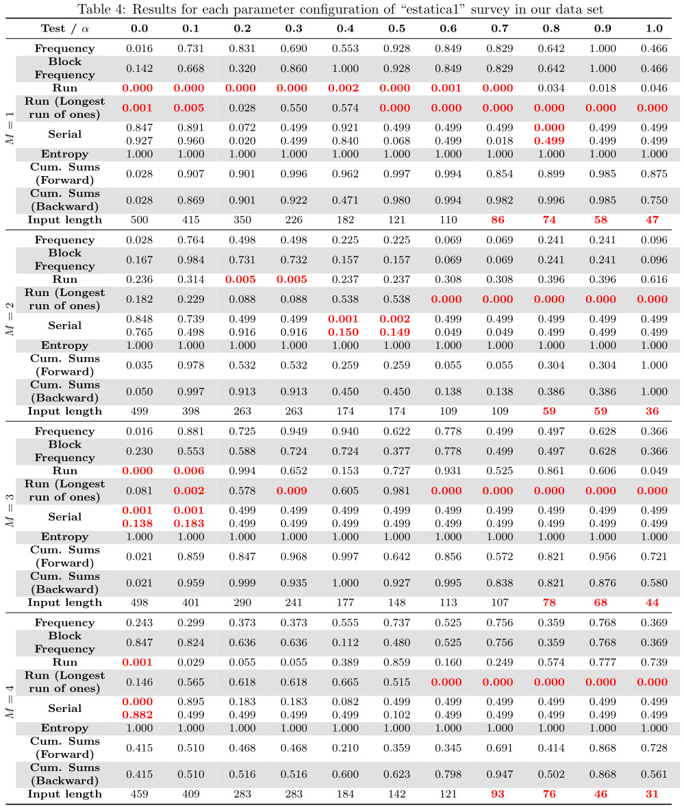

# tables-suite

This folder contains the tables with the data results extracted from NIST test suite.

In our publications, because of display constraints (page size, etc), sometimes not all the tables were available, so we decided to publish them here so people can have a fixed place for reference and/or to have a preview of the data.

The relationship with between each dataset survey and its results' table is the same as in the key-eval folder (i.e. each file name was copied from the suffix that identifies its survey/source).

The PDF file contains all the tables in a vectorized representation for higher quality of image.

## Preview example

One example of the tables inside the files of this folder is depicted below:

